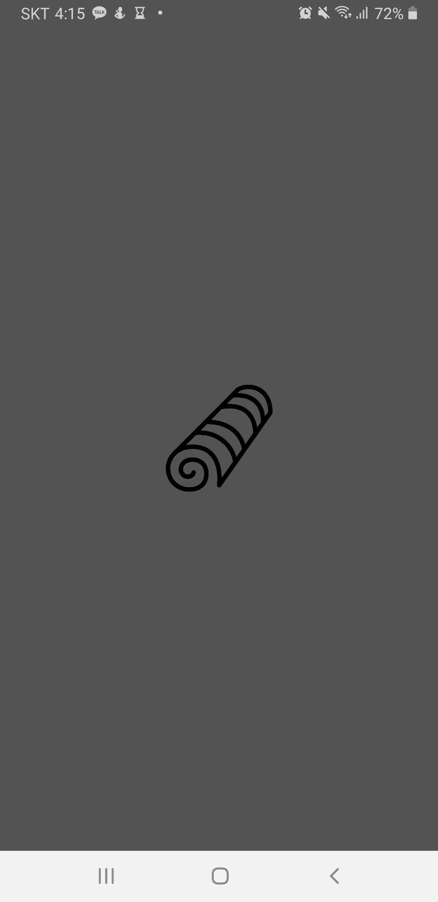

# DotjariApp - 안드로이드 채팅 앱  

[제작기간] 4주     
[프로젝트 내용] 안드로이드 채팅 앱    
[프로젝트 인원] 1명    
   
* * *
### SKILL  
  >  * Android : Java, Firebase - Authentication, Firebase - Realtime Database, Gson, Glide
  >  * Firebase Authentication을 활용한 회원가입, 로그인
  >  * Firebase Realtime Database를 활용한 회원정보 CRUD 
  >  * Firebase fcm 활용한 메시지 도착 알림 
  >  * 친구검색, 등록, 삭제 
  >  * 사용자 접속상태, 메시지 확인상태 구현
  >  * 채팅방 생성하여 1대1 채팅 구현
* * *
### 페이지 세부 기능 
  > ### 회원가입 / 로그인 / loading 화면 
  > </img>
  </img>    
  </img>
  </img>
  > * Firebase Authentication 을 활용한 회원가입과 로그인 구현 
  > * 앱 처음 실행할 때, 로그인할 때 각각 로딩화면 구현 
  > * * *
  > ### 프로필 정보 변경 / 프로필 자세히 보기 
  > </img>
  </img>    
  > </img>
  </img>    
  > * 이름, 상태, 이미지 변경    
  > * 프로필 자세히 보기
  > * * *
  > ### 친구찾기 
  > </img>
  > * 사용자 이름으로 친구검색 기능 구현 
  > * * *
  > ### 친구요청 / 친구수락 / 친구목록추가
  > </img>
  </img>      
  </img>
  </img>    
  > * * *
  > ### 채팅하기 / 읽음, 읽지않음 표시 / 메세지 도착 알림 
  > </img>
  </img>    
  </img>
  </img>    
  > * * *
